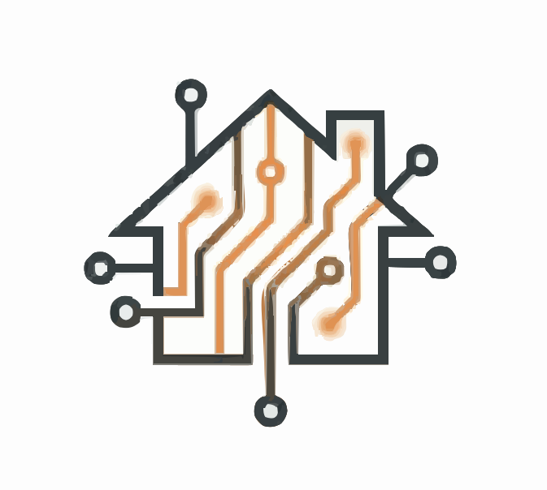

#  Roomify

> Build beautiful spaces at the speed of thought.

Roomify is an **AI-first architectural design environment** that helps users visualize, render, and manage architectural projects with unprecedented speed. By transforming 2D floor plans into photorealistic 3D visualizations, Roomify bridges the gap between technical drafting and visual realization.

---

## ✨ Key Features

- 🏗️ **AI Visualization**: Convert 2D blueprints into stunning 3D renders using advanced neural rendering.
- 🎨 **Material Exploration**: Experiment with different floor textures and wall colors in real-time.
- 🗂️ **Project Management**: Securely store and organize your architecture projects in a sleek grid interface.
- �️ **Permanent Demolition**: Unique themed delete functionality with a "Demolish" confirmation modal.
- � **High-Res Export**: Download your renders for professional presentations or client meetings.
- 🌐 **Instant Sharing**: Share your vision with the community via simple, permanent links.
- ☁️ **Cloud Storage**: Powered by Puter.js for secure, decentralized hosting and data persistence.

---

## 🛠️ The Tech Stack

Roomify is built on a modern, high-performance stack designed for speed and scalability:

- **Frontend**: [React Router 7](https://reactrouter.com/) (Remix-style)
- **Styling**: [Tailwind CSS 4](https://tailwindcss.com/) & Vanilla CSS
- **Backend/Infrastructure**: [Puter.js](https://puter.com/) (Distributed KV Storage, Worker Nodes, and Hosting)
- **Icons**: [Lucide React](https://lucide.dev/)
- **UI Components**: Handcrafted custom components for a premium feel.

---

## 🚀 Getting Started

### Prerequisites

- Node.js (v18 or higher)
- A Puter.com account (for environment variables)

### Installation

1. Clone the repository:
   ```bash
   git clone https://github.com/rohit1verma/Roomify.git
   cd Roomify
   ```

2. Install dependencies:
   ```bash
   npm install
   ```

3. Configure environment:
   Create a `.env.local` file in the root and add your Puter worker URL:
   ```env
   VITE_PUTER_WORKER_URL=your_worker_url_here
   ```

4. Launch the development server:
   ```bash
   npm run dev
   ```

---

## 📂 Project Structure

```text
├── app/
│   ├── routes/          # Application pages (Home, Visualizer)
│   ├── components/      # UI components (Navbar, Upload, Modal)
│   └── app.css          # Global design system
├── lib/
│   ├── puter.action.ts  # Puter SDK service layer
│   └── puter.worker.js  # Edge worker logic for KV storage
├── public/              # Static assets
└── type.d.ts            # Global TypeScript definitions
```

---

## 🎨 Design System

Roomify follows a minimalist "Editorial" aesthetic:
- **Typography**: *Instrument Serif* for headlines, *Inter* (Sans) for data.
- **Palette**: A balance of `Background (#FDFBF7)` and high-contrast `Primary Orange (#F97316)`.
- **Aesthetic**: Glassmorphism, subtle micro-animations, and clean grid layouts.

---

## 🤝 Contributing

Contributions are what make the open-source community such an amazing place to learn, inspire, and create. Any contributions you make are **greatly appreciated**.

---

Built with ❤️ by [Rohit Kumar](https://github.com/rohit1verma) using React Router and Puter.
